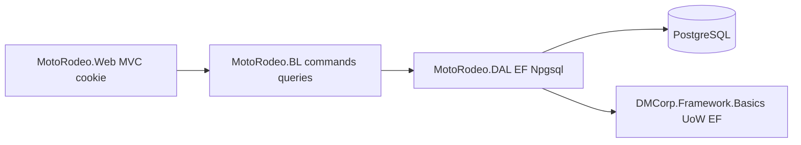
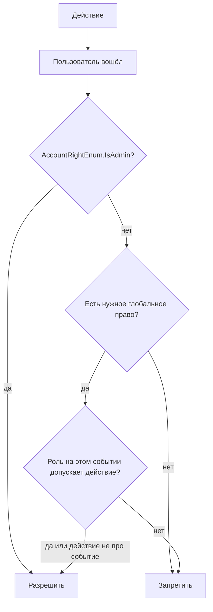
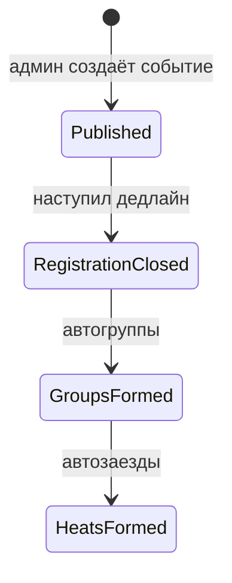

# МотоРодео — первый срез (домен + MVC)

Репозиторий уже содержит пустые слои [MotoRodeo.Web](MotoRodeo.Web/MotoRodeo.Web.csproj) → [MotoRodeo.BL](MotoRodeo.BL/MotoRodeo.BL.csproj) → [MotoRodeo.DAL](MotoRodeo.DAL/MotoRodeo.DAL.csproj) на `net10.0`. Этот план наполняет их предметной областью, CQRS и базовым UI.

## Архитектура




- **Web:** cookie-аутентификация (как в DM.Web.Admin), **без ASP.NET Identity и без `[Authorize(Roles=...)]`**. На защищённых страницах `[Authorize]` (вошёл). В cookie — `NameIdentifier` (AccountId) и `ClaimTypes.Role` как JSON-массив **Guid прав** (`GetEnumGuid()`). Решение «можно ли действие» — `IAdvancedSecurityService` + BL.
- **BL:** бизнес-логика, CQRS, проверка прав (`HasRight` / `HasAnyRight`) и роли на событии. У `IsAdmin` (`AccountRightEnum.IsAdmin`) все проверки прав проходят.
- **DAL:** сущности `IEntityBase` по образцу [C:\\Dev\\DM_Remaster\\DM.DAL](C:/Dev/DM_Remaster/DM.DAL): `DBAccount`, `DBAccountLogin`, `DBAccountRight`, события/группы/заезды. Контекст — `GuidEnumConverterExtension<T>` для enum-колонок.
- Пакет Basics **1.1.3 / net9 + EF 9**. Подключаем последнюю версию; EF/Npgsql 10 в DAL. Логин/пароль в `DBAccountLogin`, без внешнего IdP на первом срезе (`AccountLoginTypeEnum.Login`).

Регистрация сервисов: `AddMotoRodeoDal` / `AddMotoRodeoBl` из соответствующих проектов, вызов из [Program.cs](MotoRodeo.Web/Program.cs).

## Права и логические роли

«Участник / администратор / судья» — логические роли продукта. Технически права — **enum в DAL**, интеграция как в DM.DAL.

### Каталог прав — `AccountRightEnum`

Файл по образцу [DM.DAL/Enums/AccountRightEnum.cs](C:/Dev/DM_Remaster/DM.DAL/Enums/AccountRightEnum.cs): `Description` + `[EnumGuid("...")]` из `DMCorp.Framework.Basics.Attributes`. В БД колонка хранит **Guid** права, не int.

```csharp
public enum AccountRightEnum
{
    [Description("Полное всеобъемлющее право на любые действия")]
    [EnumGuid("...новый стабильный Guid...")]
    IsAdmin, // суперадмин: HasRight/HasAnyRight всегда true

    [Description("Создание и редактирование событий")]
    [EnumGuid("...")]
    ManageEvents,

    [Description("Может судить заезды")]
    [EnumGuid("...")]
    CanJudge,

    [Description("Может участвовать в событиях")]
    [EnumGuid("...")]
    CanParticipate,
}
```

Guid для каждого члена enum фиксируются один раз и не меняются (как `IsAdmin` в DM: `77A4BDF5-...`). Для МотоРодео — **свои** Guid, не копировать guid'ы DM.

### DAL

Как [DBAccountRight](C:/Dev/DM_Remaster/DM.DAL/Entities/DBAccountRight.cs) и [DMMainContext](C:/Dev/DM_Remaster/DM.DAL/Context/DMMainContext.cs):

- `DBAccountRight : IEntityBase` → таблица `AccountRights`, уникальный индекс `(AccountId, Right)`, FK на `DBAccount`.
- `OnModelCreating`: `modelBuilder.Entity<DBAccountRight>().Property(d => d.Right).HasConversion(new GuidEnumConverterExtension<AccountRightEnum>());`
- То же для других enum (тип логина и т.д.).
- `DBAccount.AccountRights` — коллекция связей.
- `DisableCascadeDeleteConvention()`, `UseIdentityColumns()` — как в DM, если Basics это даёт.

Учётки не Identity: `DBAccount` (`IEntityBase`, `ISoftDeleteEntity`, `IEntityWithDateCreated`) + `DBAccountLogin` (логин/хеш пароля, `AccountLoginTypeEnum`).

### Проверка в runtime

Как [SecurityService](C:/Dev/DM_Remaster/DM.Web.Admin/Services/SecurityService.cs) (`IAdvancedSecurityService`):

- при входе права кладутся в claim JSON списка Guid (`right.GetEnumGuid()`);
- `HasRight` / `HasAnyRight` сравнивают Guid;
- `IsAdmin` = наличие `AccountRightEnum.IsAdmin` → остальные права не проверяются.

Выдача прав: только `IsAdmin` (экран пользователей, команда пишет `DBAccountRight`). Seed Development: логин из `appsettings` + право `IsAdmin`.

### Роль в конкретном событии

Задаётся **при создании и редактировании события** (списки в карточке), не глобальным правом:

- `EventParticipant` — участник этого события;
- `EventJudge` — судья этого события.

На одном событии пользователь **либо** участник, **либо** судья, не оба. `IsAdmin` может править составы в любой момент. **После `Ready` состав меняет только `IsAdmin`**, без автопересборки сетки в этом срезе.

Пока регистрация открыта, пользователь с `CanParticipate` может сам подтвердить/снять участие, если его ещё не назначили судьёй. Админ с `ManageEvents` может добавить/убрать участников и судей в форме события (судья — только из пользователей с `CanJudge`).



Проверки живут в BL (сервис авторизации / behavior MediatR), не в `[Authorize(Roles=...)]` и не в policy по именам ролей.

## Жизненный цикл события




Сущность `Event`:

- название, дата/время, место;
- `RegistrationClosesDaysBefore` (≥ 0): дедлайн = `EventDate.Date - N days` (конец предыдущего календарного дня или начало суток события минус N дней — зафиксируем как **начало календарного дня события минус N суток**);
- `GroupCount` (≥ 1), задаётся админом **до** автоформирования (поле события);
- статус: `Published` / `RegistrationClosed` / `Ready` (группы и заезды готовы).

Пока `now < deadline` пользователь с правом `CanParticipate` может подтвердить или снять участие (если не судья этого события). После дедлайна саморегистрация отклоняется; `IsAdmin` может править состав через карточку события.

**Автоматика закрытия регистрации:** без Hangfire, очередей и отдельного job-сервера. Идемпотентная команда `CloseRegistrationAndBuildGrid`: её вызывает лёгкий `IHostedService` (периодическая проверка дедлайнов в процессе Web) и любой запрос/команда к событию после дедлайна. Повторный вызов не пересобирает сетку, если статус уже `Ready`.

**Оповещения** в этом срезе нет (письма, push, SMS). Если понадобятся — отдельный функционал оповещений, не вшивать хуки «отправить письмо» в команды сетки/регистрации.

Ограничения: `GroupCount` не больше числа подтверждённых участников; при 0 участников событие закрывается без групп (или с пустой сеткой — покажем пустое состояние).

## Группы

После закрытия регистрации:

1. взять всех с подтверждённым участием;
2. перемешать (`RandomNumberGenerator`);
3. разложить по `GroupCount` группам **round-robin** (размеры отличаются максимум на 1).

Один участник — одна группа. Пересборки в этом срезе нет (только если явно добавим команду админа позже).

## Заезды (пара → два заезда подряд)

Для каждой группы независимо. Покрытие: **каждый с каждым** ровно один раз как неупорядоченная пара.

Сама пара **не упорядочена** (нет «домашней» стороны). Как только пара ставится в сетку, участники едут **строго друг за другом, без чужих заездов между ними**:

1. первый заезд: участник A — лидер, B — догоняющий;
2. следующий заезд: те же A и B, места меняются (B лидер, A догоняющий).

Кто в паре «A» и «B»: стабильное правило после жеребьёвки (меньший стартовый номер в группе — A, он едет лидером первым). Порядок **пар** в сетке — детерминированный обход всех `C(N,2)` сочетаний (например по возрастанию номеров), не параллельные слоты разных пар.

Итог для группы из N: `N*(N-1)` заездов (две подряд на каждую пару). Группа из 1 человека — без заездов.

Сущности: `EventGroup`, `GroupMember` (стартовый номер в группе), `Heat` (`Sequence` в группе, `LeaderId`, `ChaserId`, ссылка на пару/`MatchupId` чтобы два заезда были связаны). Параллельные слоты / несколько трасс в этом срезе не моделируем.

## Выгрузка

Два варианта (на экране таблица + файл):

- полный список участников события;
- список с разбиением по группам.

Формат файла: **CSV (UTF-8 BOM)** — без лицензий Excel; открывается в Excel как таблица.

## MVC и фронтенд

Сначала вычистить шаблон Visual Studio из [MotoRodeo.Web](MotoRodeo.Web): Privacy, welcome/Index про ASP.NET, футер с копирайтом шаблона, `ErrorViewModel`/страница ошибки шаблона — заменить на простую ошибку, `wwwroot/lib` целиком (старые бандлы bootstrap/jquery/validation из шаблона), `importmap`, сгенерированный `*.styles.css` layout, лишний `site.css` шаблона. `_Layout` и Home — с нуля под МотоРодео.

### Библиотеки

Только **последние стабильные** на момент внедрения (не Bootstrap 6 alpha):

- Bootstrap 5 (CSS + `bootstrap.bundle.min.js`) — сейчас ориентир **5.3.8**, при сборке взять актуальный 5.x stable;
- jQuery (slim не обязателен — полный min, актуальный 3.x stable).

Другие клиентские библиотеки **только если без них нельзя** (например jquery-validation — не тащить заранее: серверная валидация + HTML5). Без npm-SPA, без React, без лишних иконочных пакетов.

Подключение: CDN с SRI **или** актуальные файлы в `wwwroot/lib` (не копия шаблона VS).

### UI: просто и с телефона

Mobile-first, русский `lang="ru"`, `viewport`.

- Навигация: компактный navbar + collapse/offcanvas, крупные пункты под палец.
- Формы (вход, событие, права): одна колонка, `form-control` на всю ширину, кнопки `btn-lg` / full-width на узком экране.
- Списки событий/заездов: карточки или список, не широкая таблица как основной вид на телефоне.
- Таблицы (сетка, выгрузка на экране): обёртка `table-responsive`, на мобиле предпочтительно те же данные карточками по группам.
- Без декоративного «dashboard», hero, каруселей.

### Экраны по правам


| Кто | Экраны |
| --- | --- |
| Гость | регистрация учётки, вход |
| `CanParticipate` | список событий, подтвердить/отменить участие (пока открыто), свои группа/заезды если назначен участником |
| `ManageEvents` | CRUD события, состав участников и судей в карточке события, сетка, CSV |
| `CanJudge` + роль судьи на событии | просмотр групп и заездов этого события (без результатов) |
| `AccountRightEnum.IsAdmin` | все экраны выше плюс выдача/снятие прав (`DBAccountRight`) |

Меню и кнопки — по `AccountRightEnum` и роли на событии.

## CQRS в BL (ориентир команд/запросов)

Команды: `RegisterUser`, `SetAccountRights` (`AccountRightEnum[]`), `CreateEvent`, `UpdateEvent` (поля + составы участников/судей), `ConfirmEventParticipation`, `CancelEventParticipation`, `CloseRegistrationAndBuildGrid`.

Запросы: списки событий, детали события, участники, группы, заезды, CSV.

Хендлеры не ходят в UI; валидация — FluentValidation + pipeline MediatR.

## Модель данных (сжато)

- `DBAccount`, `DBAccountLogin`, `DBAccountRight` (`Right`: `AccountRightEnum` ↔ Guid)
- `Event`, `EventParticipant`, `EventJudge` (FK на `DBAccount`)
- `EventGroup`, `GroupMember`, `Heat` (и при необходимости `Matchup` для связки двух подряд заездов одной пары)

Индексы: уникальность `(EventId, UserId)` на регистрациях и судьях; уникальность участника в группе события.

Миграции EF в DAL, Npgsql, connection string в [appsettings.json](MotoRodeo.Web/appsettings.json).

## Вне скоупа этого среза

Результаты/очки, автоматическая пересборка сетки после правок состава, несколько трасс / параллельные заезды разных пар, Hangfire, ASP.NET Identity / `[Authorize(Roles=...)]`, оповещения (отдельный функционал позже), публичный сайт без логина, отдельный API.

## Проверка

- Юнит-тесты в новом `MotoRodeo.BL.Tests`: равные размеры групп; запрет участник+судья на одном событии; покрытие пар и два заезда подряд; идемпотентность закрытия регистрации; `IsAdmin` проходит без остальных прав; без `ManageEvents` нельзя создать событие; без `CanJudge` нельзя назначить судьёй.
- Ручной прогон MVC **с узким viewport (телефон)**: регистрация → событие → подтверждения → дедлайн → группы/заезды → CSV → судья. Проверить меню, формы и сетку пальцем (не только desktop). Если браузерные инструменты недоступны — `dotnet test` + описание ручного сценария.

